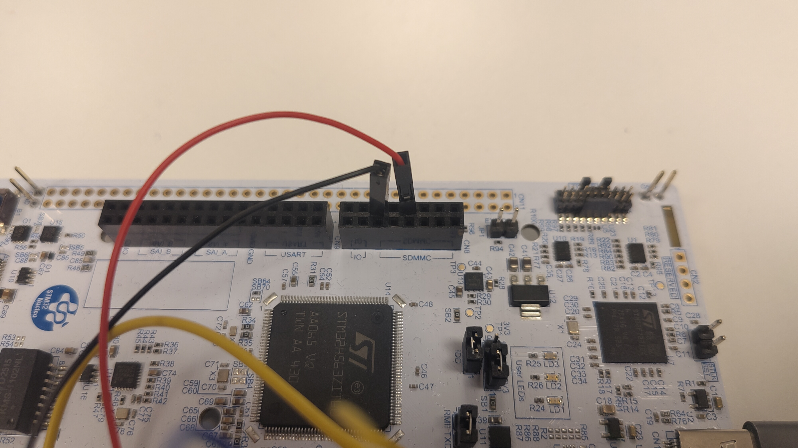

# Session 1: Foundation

**Goal:** Getting up and running

---
# The tools

* rustup - https://rustup.rs/ - makes it easy to manage multiple versions of the compiler
* probe-rs https://probe.rs/ - remember to setup the correct permissions as described in https://probe.rs/docs/getting-started/probe-setup/
* ARM gcc toolchain (for building C library and various tools)
* git clone https://github.com/digilias/embedded-rust-workshop

--- 
# General info

* 5-20 minute introduction to a topic
* 15-45 minute practice
* 0-15 minute discussion and questions

---
# The workshop project

* Located in the `practice/workshop` folder
* We will use this throughout the workshop and update it
* Contains necessary deps in `Cargo.toml`
* Help snippets can be found in `practice/.cheating` - please use these if you get stuck
* `practice/workshop/README.md` contains references to relevant docs for each session
* We will do exercises together

---
# Sessions (part 1)

* Session 2: PAC and HAL
* Session 3: Platform agnostic drivers
* Session 4: More HAL
* Session 5: Interrupts
* Session 6: Async fundamentals
* Session 7: Async and Interrupts

---
# Sessions (part 2)
* Session 8: Embassy
* Session 9: Sharing state
* Session 10: Executor and preemption
* Session 11: Panicking, logging, debugging
* Session 12: C with your Rust
* Session 13: Networking

---
# Devkit wiring

---
# Devkit wiring

---

# Exercise

* Get all the tools installed
* Start with the workshop project - `cd practice/workshop`
* Run it - `cargo run --release`
